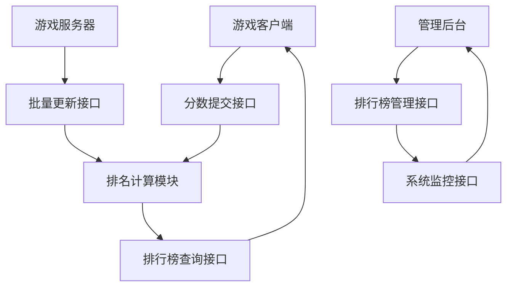

# 分布式游戏排行榜系统 - 产品需求文档

## 1. 产品概述

分布式游戏排行榜系统是一个高性能、高并发的微服务节点，专门处理游戏中的排行榜数据管理和查询服务。
系统支持动态伸缩和多节点部署，确保在大规模游戏场景下提供稳定可靠的排行榜服务，同时保证数据的强一致性。
目标是为百万级并发用户提供毫秒级响应的排行榜查询和更新服务。

## 2. 核心功能

### 2.1 用户角色

| 角色 | 注册方式 | 核心权限 |
|------|----------|----------|
| 游戏客户端 | 游戏服务器认证 | 查询排行榜、提交分数 |
| 游戏服务器 | 服务间认证 | 批量更新分数、管理排行榜 |
| 运维管理员 | 内部系统认证 | 监控系统状态、配置管理 |

### 2.2 功能模块

系统包含以下核心页面和模块：
1. **排行榜查询接口**：实时排行榜数据查询、分页查询、排名变化查询
2. **分数更新接口**：单个/批量分数提交、分数验证、排名计算
3. **排行榜管理接口**：创建排行榜、配置规则、数据清理
4. **系统监控接口**：性能指标监控、健康检查、负载状态

### 2.3 页面详情

| 页面名称 | 模块名称 | 功能描述 |
|----------|----------|----------|
| 排行榜查询接口 | 实时查询模块 | 根据排行榜ID查询TOP N排名，支持分页和实时更新 |
| 排行榜查询接口 | 个人排名模块 | 查询指定用户的排名和周围排名信息 |
| 分数更新接口 | 分数提交模块 | 接收游戏分数更新请求，验证数据合法性 |
| 分数更新接口 | 排名计算模块 | 实时计算用户排名变化，更新排行榜数据 |
| 排行榜管理接口 | 配置管理模块 | 创建和配置不同类型的排行榜规则 |
| 排行榜管理接口 | 数据维护模块 | 定期清理过期数据，维护数据完整性 |
| 系统监控接口 | 性能监控模块 | 监控QPS、延迟、错误率等关键指标 |
| 系统监控接口 | 健康检查模块 | 提供服务健康状态检查和自动故障转移 |

## 3. 核心流程

**游戏客户端流程：**
用户在游戏中获得分数 → 游戏客户端提交分数到排行榜服务 → 系统验证并更新排名 → 返回最新排名信息 → 客户端查询排行榜显示给用户

**游戏服务器流程：**
游戏服务器收集批量分数数据 → 批量提交到排行榜服务 → 系统进行批量排名计算 → 更新缓存和持久化存储 → 通知相关客户端排名变化

**系统管理流程：**
运维人员配置排行榜规则 → 系统创建新的排行榜实例 → 设置数据清理策略 → 监控系统运行状态 → 根据负载情况进行扩缩容

## 4. 用户界面设计

### 4.1 设计风格

- **主色调**：深蓝色 (#1E3A8A) 和金色 (#F59E0B)
- **辅助色**：灰色 (#6B7280) 和绿色 (#10B981)
- **按钮样式**：圆角矩形，渐变效果，悬停动画
- **字体**：Roboto 14px/16px，数字使用等宽字体
- **布局风格**：卡片式布局，响应式设计
- **图标风格**：线性图标，统一的视觉风格

### 4.2 页面设计概览

| 页面名称 | 模块名称 | UI元素 |
|----------|----------|--------|
| 排行榜查询接口 | 排行榜列表 | 表格布局，排名徽章，分数高亮显示，分页控件 |
| 分数更新接口 | 提交表单 | 简洁的输入框，实时验证提示，提交状态指示器 |
| 系统监控接口 | 监控面板 | 实时图表，状态指示灯，告警通知区域 |

### 4.3 响应式设计

系统采用API优先的设计理念，主要为游戏客户端和服务器提供RESTful API接口。管理界面支持桌面端访问，采用响应式布局适配不同屏幕尺寸。