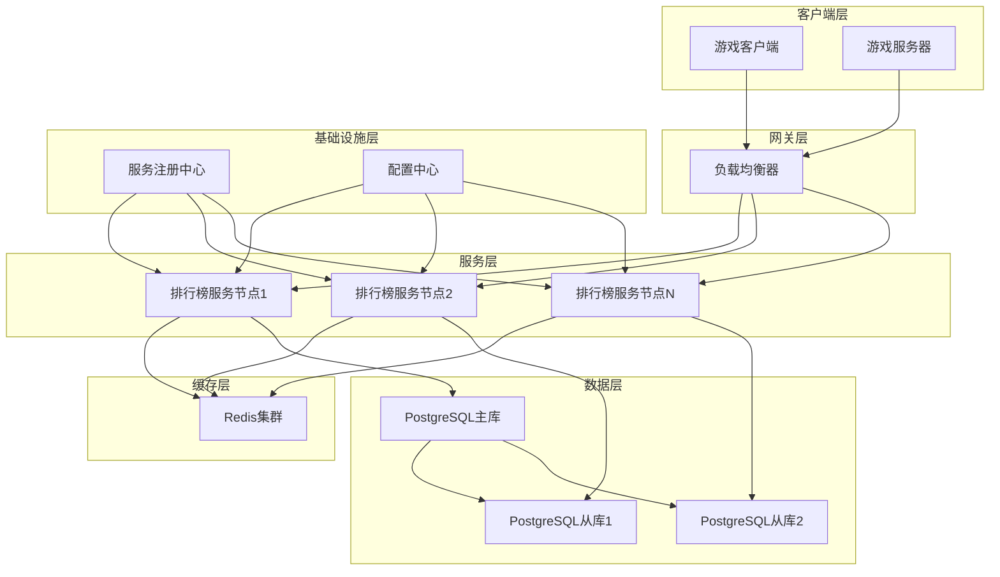
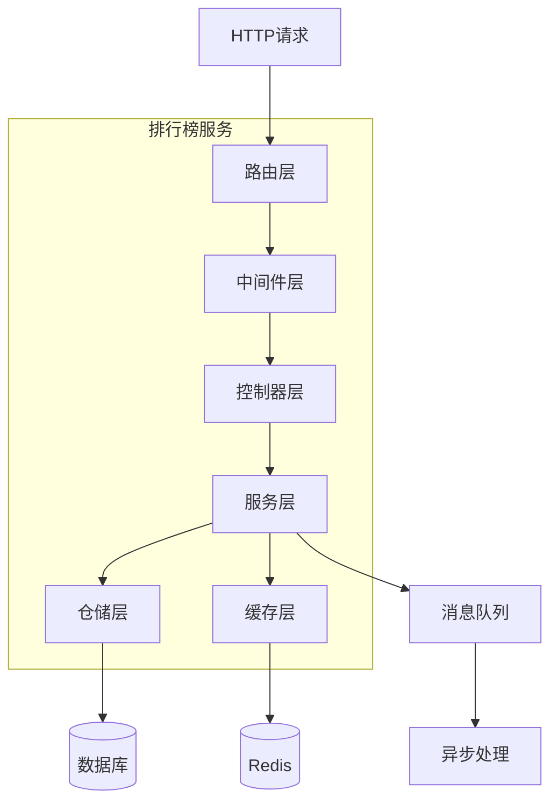
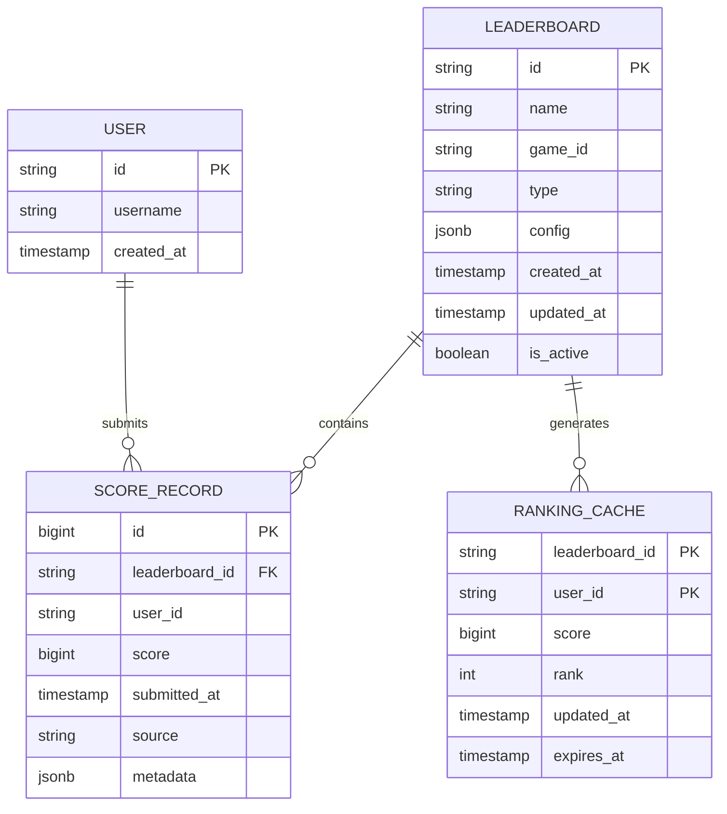

# 分布式游戏排行榜系统 - 技术架构文档

## 1. 架构设计



## 2. 技术描述

- **前端**: 无（纯API服务）
- **后端**: Go 1.21 + netcore-go网络库 + spoor日志库
- **数据库**: PostgreSQL 15（主从复制）
- **缓存**: Redis 7.0 集群模式
- **服务发现**: Consul
- **配置管理**: Consul KV
- **负载均衡**: Nginx + Consul Template
- **监控**: Prometheus + Grafana
- **容器化**: Docker + Kubernetes

## 3. 路由定义

| 路由 | 用途 |
|------|------|
| GET /api/v1/leaderboard/:id | 查询指定排行榜数据 |
| GET /api/v1/leaderboard/:id/rank/:userId | 查询用户排名 |
| POST /api/v1/score/submit | 提交单个用户分数 |
| POST /api/v1/score/batch | 批量提交分数 |
| POST /api/v1/leaderboard/create | 创建新排行榜 |
| PUT /api/v1/leaderboard/:id/config | 更新排行榜配置 |
| DELETE /api/v1/leaderboard/:id | 删除排行榜 |
| GET /api/v1/health | 健康检查 |
| GET /api/v1/metrics | 性能指标 |

## 4. API定义

### 4.1 核心API

**排行榜查询**
```
GET /api/v1/leaderboard/:id
```

请求参数:
| 参数名 | 参数类型 | 是否必需 | 描述 |
|--------|----------|----------|------|
| id | string | true | 排行榜ID |
| limit | int | false | 返回数量，默认100 |
| offset | int | false | 偏移量，默认0 |

响应:
| 参数名 | 参数类型 | 描述 |
|--------|----------|------|
| code | int | 响应状态码 |
| data | object | 排行榜数据 |
| message | string | 响应消息 |

示例:
```json
{
  "code": 200,
  "data": {
    "leaderboard_id": "global_score",
    "rankings": [
      {
        "rank": 1,
        "user_id": "user123",
        "score": 99999,
        "updated_at": "2024-01-01T12:00:00Z"
      }
    ],
    "total": 1000000
  },
  "message": "success"
}
```

**分数提交**
```
POST /api/v1/score/submit
```

请求:
| 参数名 | 参数类型 | 是否必需 | 描述 |
|--------|----------|----------|------|
| leaderboard_id | string | true | 排行榜ID |
| user_id | string | true | 用户ID |
| score | int64 | true | 分数 |
| timestamp | int64 | true | 时间戳 |

响应:
| 参数名 | 参数类型 | 描述 |
|--------|----------|------|
| code | int | 响应状态码 |
| data | object | 更新后的排名信息 |

## 5. 服务架构图



## 6. 数据模型

### 6.1 数据模型定义



### 6.2 数据定义语言

**排行榜表 (leaderboards)**
```sql
-- 创建表
CREATE TABLE leaderboards (
    id VARCHAR(64) PRIMARY KEY,
    name VARCHAR(255) NOT NULL,
    game_id VARCHAR(64) NOT NULL,
    type VARCHAR(32) NOT NULL CHECK (type IN ('global', 'daily', 'weekly', 'monthly')),
    config JSONB DEFAULT '{}',
    created_at TIMESTAMP WITH TIME ZONE DEFAULT NOW(),
    updated_at TIMESTAMP WITH TIME ZONE DEFAULT NOW(),
    is_active BOOLEAN DEFAULT true
);

-- 创建索引
CREATE INDEX idx_leaderboards_game_id ON leaderboards(game_id);
CREATE INDEX idx_leaderboards_type ON leaderboards(type);
CREATE INDEX idx_leaderboards_active ON leaderboards(is_active);
```

**分数记录表 (score_records)**
```sql
-- 创建表
CREATE TABLE score_records (
    id BIGSERIAL PRIMARY KEY,
    leaderboard_id VARCHAR(64) NOT NULL,
    user_id VARCHAR(64) NOT NULL,
    score BIGINT NOT NULL,
    submitted_at TIMESTAMP WITH TIME ZONE DEFAULT NOW(),
    source VARCHAR(32) DEFAULT 'game',
    metadata JSONB DEFAULT '{}'
);

-- 创建索引
CRE